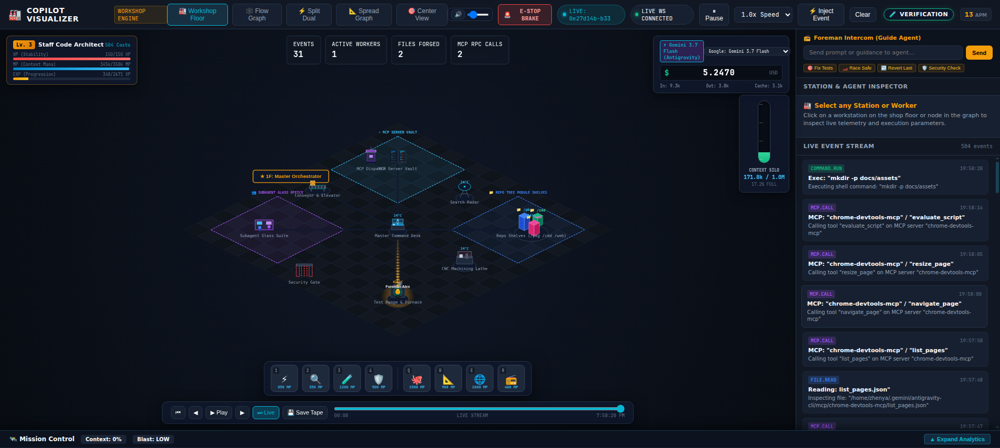

# 🏭 Copilot Visualizer

> Real-time multi-agent observability HUD — rendered as an isometric industrial factory floor



[](https://github.com/igenexxx/copilot-visualizer/actions/workflows/ci.yml)
[](https://github.com/igenexxx/copilot-visualizer/releases/latest)
[](go.mod)
[](LICENSE)

---

**Copilot Visualizer** translates live AI coding agent activity into an interactive **Factory Workshop** — an isometric 2D canvas where every tool call, subagent, file write, and test run becomes a visible machine, worker, and moving part.

Supports **GitHub Copilot CLI**, **Antigravity (AGY)**, **Claude**, and any agent emitting structured JSONL events.

---

## ✨ Features

| | |
|---|---|
| 🏗️ **Isometric Factory Floor** | Workers, CNC lathes, furnaces, radars, conveyor belts rendered on a live canvas |
| 🌆 **Multi-Floor Architecture** | One floor per active agent; sidebar minimap when >1 agent, building silhouette when >10 |
| 📡 **Auto-Discovery** | Automatically detects running Antigravity / Copilot sessions from local log files |
| 🎮 **Demo Simulator** | Built-in realistic multi-agent scenario (no external agents required) |
| 🗺️ **Mission Control** | Causal flow graph, blast radius, goal tracker, context saturation — lazy-evaluated only when panel is open |
| 🖥️ **Desktop App** | Native window via Wails v2 (WebKit/WebView2) — no browser, no ports |
| 🌐 **Web Server Mode** | Embedded UI binary; browser at `localhost:9876` |
| 📼 **Session Recorder** | Record / replay agent sessions as tape files |
| 🔌 **MCP Proxy** | Transparent JSON-RPC shim for any MCP server toolchain |
| 🚨 **Interventions** | Emergency stop, intercom guidance, human-in-the-loop prompts |

---

## 🕹️ Workshop Metaphor

| Agent Activity | Factory Element | Visual |
|:---|:---|:---|
| Foreman / Orchestrator | Master Command Desk | Blueprints, planning thought bubbles |
| `view_file` | Filing Vault | Steel cabinets with blue scanning light |
| `grep_search` | Search Radar | Hexagonal base with oscillating sweep |
| `write_file` / patch | CNC Machining Lathe | Laser cutter, flying sparks |
| Command / test run | Test Furnace | Reactor with steam, green pass flame |
| MCP tool call | Phone Booth & Dispatch | Ringing lights, pneumatic tube delivery |
| Subagent delegation | Specialist Worker | Worker clocks in, walks to station |
| Session complete / PR | Shipping Conveyor | Code crate delivered with confetti |

---

## 🚀 Quick Start

### Option A — Desktop App (native window)

Download the binary for your platform from [Releases](https://github.com/igenexxx/copilot-visualizer/releases/latest) and run:

```bash
# Linux
./copilot-visualizer-desktop-linux-amd64 --demo

# macOS (universal — Intel + Apple Silicon)
./copilot-visualizer-desktop-darwin-universal --demo

# Windows
copilot-visualizer-desktop-windows-amd64.exe --demo
```

### Option B — Web Server (browser at localhost:9876)

```bash
# Download server binary and run
./copilot-visualizer-server-linux-amd64 -port=9876 -demo=true
# Open http://localhost:9876
```

### Option C — Build from Source

**Prerequisites:** Go ≥ 1.22, Node.js ≥ 20, [Task](https://taskfile.dev)

```bash
git clone https://github.com/igenexxx/copilot-visualizer
cd copilot-visualizer

# Install dependencies
task install

# Run web server in demo mode (hot-reload dev)
task dev:server     # Go backend on :9876
task dev:web        # Vite on :5173

# OR build production binary
task build
./copilot-visualizer -port=9876
```

**Build native desktop app:**

```bash
# Linux (requires libwebkit2gtk-4.1-dev, libgtk-3-dev)
task build:desktop:linux

# macOS (requires Xcode)
task build:desktop:darwin-arm64   # Apple Silicon
task build:desktop:darwin-amd64   # Intel
task build:desktop:darwin-universal  # fat binary

# Windows (requires WebView2 SDK, NSIS)
task build:desktop:windows
```

---

## 📦 Distribution

Cross-platform release artifacts are built automatically by GitHub Actions on every push to `main`.

| Platform | Desktop App | Headless Server |
|---|---|---|
| Linux x86_64 | ✅ `.tar.gz` | ✅ `.tar.gz` |
| Linux ARM64 | — | ✅ `.tar.gz` |
| macOS Intel | ✅ `.zip` / `.app` | ✅ `.tar.gz` |
| macOS Apple Silicon | ✅ `.zip` / `.app` | ✅ `.tar.gz` |
| macOS Universal | ✅ fat binary | — |
| Windows x86_64 | ✅ `.exe` + NSIS installer | ✅ `.zip` |

Verify downloads:
```bash
sha256sum -c checksums.sha256
```

---

## 🔌 Integration Modes

### 1. Auto-Discovery & Multi-Agent Session Enricher (Zero Config)
The engine automatically monitors and unifies live telemetry across multiple AI coding clients using an event-driven kernel file watcher (`fsnotify` with zero polling):

```
~/.copilot/session-store.db         → GitHub Copilot CLI (SQLite assistant_usage_events)
~/.gemini/antigravity-cli/brain/*/  → Google Antigravity (Brain transcript_full.jsonl)
~/.claude/projects/*.jsonl          → Anthropic Claude Code transcripts
```

- **Live REST Endpoints:**
  - `GET /api/enrichment/usage?id=<sessionId>`: Returns exact model, active context window depth, input/output/cache tokens, and USD cost.
  - `GET /api/enrichment/all`: Returns fleet-wide telemetry across all active agents.

### 2. Auto-Follow / Session Lock Control
The top navigation bar provides a **`🎯 FOLLOW: ON / LOCKED`** switch:
- **`FOLLOW: ON`**: Automatically tracks and switches the visualizer to whichever agent is currently executing tool calls.
- **`LOCKED`**: Locks the visualizer onto the currently selected session (e.g. while debugging a Copilot CLI run, background Antigravity or Claude turns will not hijack the screen).

### 3. REST / WebSocket Event Ingestion
```bash
curl -X POST http://localhost:9876/api/events \
  -H "Content-Type: application/json" \
  -d '{
    "id": "evt-101",
    "type": "file.write",
    "agentId": "crafter",
    "station": "cnc_lathe",
    "title": "Forging auth_middleware.go",
    "payload": { "lines": 42 }
  }'
```

### 4. MCP Proxy (Transparent JSON-RPC Shim)
MCP calls are **not intercepted automatically**. To get live (not log-based) MCP telemetry, run the proxy mode explicitly by wrapping your MCP server:

```bash
# Instead of:
node /path/to/mcp-server

# Run through the proxy shim (sits on stdio between client and server):
./copilot-visualizer --mcp-proxy -- node /path/to/mcp-server
```

The proxy intercepts every JSON-RPC `tools/call` request and response in real time and streams it as factory events. No changes required in the agent or MCP client.

> **Auto-Discovery** (the default mode) reads agent JSONL transcripts after the fact — MCP calls appear with a slight delay once the agent writes its step log to disk.

### 5. JSONL Log Tailer
```bash
./copilot-visualizer --tail=/path/to/session.jsonl
```

### 6. Desktop Wails IPC (programmatic)
When running as a desktop app, frontend calls Go bindings directly:
```typescript
// Available via window.go.main.App.*
await window.go.main.App.GetHistory()
await window.go.main.App.SendIntercomPrompt("Focus on auth module")
await window.go.main.App.TriggerEmergencyStop("Budget exceeded")
await window.go.main.App.ScanRepoTree("/path/to/project")
```

---

## 💾 Data Storage & Replay Files

Copilot Visualizer organizes persistent history and telemetry across dedicated storage layers:

### 1. Session Replay Tapes (`.tapes/`)
- **Location:** `./.tapes/<tape-id>.json` (or configured directory via `-tapes-dir`)
- **Modules:** [`pkg/recorder`](pkg/recorder/recorder.go) & [`pkg/simulator`](pkg/simulator/simulator.go)
- **File Structure:**
  - `events`: Array of discrete, strongly-typed agent lifecycle events with sub-millisecond timestamps.
  - `durationMs`: Total duration of the recorded coding session.
  - `fileDiffs`: Snapshots of patched files (`oldContent`, `newContent`, `addedLines`, `removedLines`).
  - `metadata`: Session title, model identifier, and total event count.
- **Purpose:** Full timeline replay in the Visualizer / Simulator at variable playback speeds (`0.5x`, `1x`, `2x`, `5x`, `10x`) for post-mortem debugging, demos, and regression analysis.

### 2. Visualizer Session State Store (`~/.copilot-visualizer/sessions/`)
- **Location:** `~/.copilot-visualizer/sessions/<session-id>/state.json`
- **Module:** [`pkg/sessionstore`](pkg/sessionstore/store.go)
- **File Structure:**
  - `rpg`: Hero progression snapshot (Engineer Level, EXP, HP, MP Mana, Unlocked Specializations).
  - `tokenomics`: Exact financial telemetry (Total Cost USD, Input/Output/Cache token counts, and per-model consumption).
  - `workstations`: Machinery health metrics (Wear %, Temperature °C, Total Operations per station).
  - `metrics`: Processed cognitive steps, loop detection flags, and blast radius state.
- **Purpose:** Seamless state persistence across application and server restarts, updated asynchronously with zero blocking overhead.

---

## 🧪 Testing

```bash
# All Go tests (race detector + coverage)
task test:go

# Frontend tests (Vitest)
task test:web

# Both
task test

# Coverage HTML report
task test:coverage
```

Go backend targets **90%+ coverage** with adversarial table-driven tests, zero-value edge cases, and `-race` safety across all packages.

---

## 🏗️ Architecture

```
copilot-visualizer/
├── cmd/server/          # Headless web server entrypoint
├── main.go              # Wails desktop entrypoint
├── app.go               # Wails Go bindings & lifecycle
├── wails.json           # Wails project config
├── pkg/
│   ├── events/          # Core Event type & constants
│   ├── hub/             # WebSocket broadcast hub (history ring-buffer)
│   ├── autodiscover/    # Session auto-discovery engine (file watcher)
│   ├── enricher/        # Multi-provider telemetry & metadata enricher (Copilot, AGY, Claude)
│   ├── copilotstore/    # Copilot CLI SQLite read-only query engine
│   ├── simulator/       # Demo scenario event stream generator
│   ├── recorder/        # Session tape recorder / replayer
│   ├── sessionstore/    # Persistent session state (JSON, flushed async)
│   ├── repotree/        # Repo directory scanner (voxel layout)
│   ├── intervention/    # Human-in-the-loop intervention manager
│   ├── mcpproxy/        # MCP JSON-RPC transparent proxy
│   ├── tailer/          # JSONL log file tail watcher
│   ├── server/          # HTTP router (REST + WebSocket + Enrichment endpoints)
│   └── providers/       # Agent-specific event parsers
│       ├── antigravity/ # AGY / Gemini CLI parser
│       ├── claude/      # Claude session parser
│       ├── copilot/     # GitHub Copilot parser (view, rg, bash, edit)
│       └── generic/     # Generic JSONL parser
└── web/                 # Vite + TypeScript frontend
    ├── src/
    │   ├── canvas/      # Isometric factory floor renderer (Canvas 2D)
    │   ├── analytics/   # Context Saturation, Goal Tracker, Blast Radius, Waterfall
    │   ├── tokenomics/  # Tokenomics Tracker & multi-model pricing tables
    │   ├── components/  # UI panels (Mission Control, Sidebar, HUD)
    │   ├── services/    # ws.ts — dual-mode transport (Wails IPC / WebSocket)
    │   └── store/       # Reactive state (Zustand-like)
    └── dist/            # Built assets (embedded into Go binary)
```

**Transport layer** — `ws.ts` auto-detects the environment:
- **Desktop (Wails)**: routes through `window.go.main.App` IPC bindings — no open ports
- **Browser**: falls back to `WebSocket ws://localhost:9876/ws`

**Performance** — Mission Control analytics (flow graph, blast radius, goal tracker) are **only computed when the panel is open**, preventing unnecessary CPU/memory usage when minimized.

---

## 🔧 Build System

All tasks are available via [Task](https://taskfile.dev):

```bash
task --list                      # All available tasks
task build:server:all            # All headless server binaries
task build:release:servers       # Build + archive + checksums (CI-ready)
task build:release:desktop:linux # Linux desktop release
task build:print-version         # Show current version
```

Cross-platform build matrix is defined in [`Taskfile.build.yml`](Taskfile.build.yml).

---

## 🚦 CI / CD

| Trigger | Workflow | Jobs |
|---|---|---|
| PR / non-main push | [`ci.yml`](.github/workflows/ci.yml) | go vet, cross-build check (5 targets), tests, type-check |
| Push to `main` | [`release.yml`](.github/workflows/release.yml) | Test → Version → Build all platforms → GitHub Release |

Release tags are derived automatically: `v2026.08.15-abc1234` (CalVer + short SHA).

---

## 📜 License

MIT © [igenexxx](https://github.com/igenexxx)
