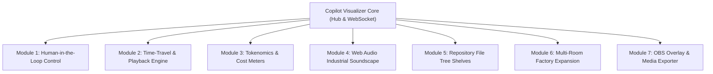
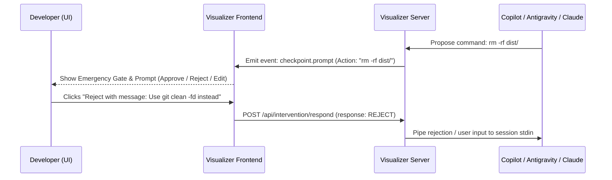
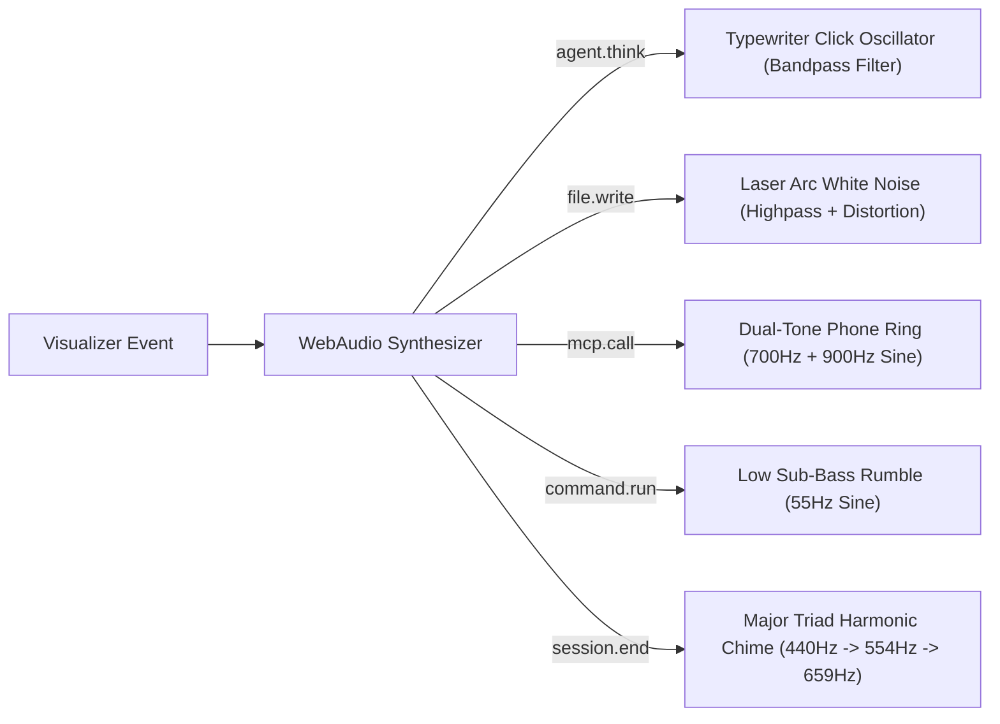

# 🏭 Copilot Visualizer — Engineering Implementation Plan (15.08.2026)

This roadmap outlines the complete architecture, data contracts, state management, frontend rendering, and test strategies for the 7 major feature expansions of **Copilot Visualizer**.



---

## 1. 🕹️ Module 1: Human-in-the-Loop & Interactive Intervention

### Objective
Allow the developer to pause, resume, guide (via intercom), and approve/reject dangerous operations (checkpoints) directly from the visualizer UI.

### Architecture & Data Flow


### Technical Specification
1. **Backend Endpoints & Control Signals (`pkg/intervention/`)**:
   - `POST /api/intervention/pause`: Sends `SIGSTOP` or agent pause control frame.
   - `POST /api/intervention/resume`: Sends `SIGCONT` or agent resume frame.
   - `POST /api/intervention/prompt`: Injects text into active session `stdin` or transcript.
   - `POST /api/intervention/respond`: Responds to pending safety checkpoints (`APPROVE`, `REJECT`, `MODIFY`).
2. **Frontend UI Components**:
   - **Emergency Stop Lever (Red Industrial Crane Handle)**: Top-right header control with pulsing amber caution stripes.
   - **Foreman Intercom Modal**: Tactical microphone popup with quick-reply presets ("Focus on unit tests", "Revert last change", "Check race condition").
   - **Safety Tollbooth Animation**: Worker pauses in front of a striped barrier when a sensitive tool (`run_command`, `git_push`) is triggered.

---

## 2. ⏪ Module 2: Time-Travel Playback & Code Diff Viewer

### Objective
Scrub backward and forward across the entire session history like a video recorder, with side-by-side diff previews of files forged by the agent.

### Technical Specification
1. **Event Snapshot Ring Buffer (`pkg/hub/session_recorder.go`)**:
   - Stores immutable chronological event frames: `type SessionTape struct { Events []*events.Event }`.
   - `GET /api/session/{id}/export`: Exports session tape as compressed JSON.
   - `POST /api/session/import`: Loads an external session tape for offline replay.
2. **Frontend Scrubbing Engine (`web/src/canvas/playback.ts`)**:
   - Dynamic timeline bar at screen bottom with event markers colored by type (`file.write`, `mcp.call`, `command.run`).
   - Frame state reconstruction: Compute worker positions, active stations, and token counts at any given millisecond offset `t`.
   - Playback speed controls (`0.25x`, `1x`, `2x`, `5x`, `10x`, `Jump to Next Step`).
3. **Monaco / Diff Visualizer Modal**:
   - Integrated lightweight syntax-highlighted diff viewer displaying file content mutations on `file.write` / `replace_file_content`.

---

## 3. 💰 Module 3: Tokenomics & Cost Telemetry (Factory Resource Gauges)

### Objective
Visualize LLM token consumption, latency, and monetary cost with analog-style gauges and identify hot-spot tools.

### Visual & Data Model
| Metric | Metaphor | Visual Element |
| :--- | :--- | :--- |
| **Context Window Used** | **Water Tower / Silo** | Cylindrical level indicator filling from 0% to 100% (Green -> Amber -> Red) |
| **Session Cost ($ USD)** | **Electric Meter Gauge** | Spinning mechanical odometer digits measuring sub-cent fractions |
| **Tokens / Sec (TPS)** | **Steam Pressure Tachometer** | Analog needle gauge reacting to streaming chunks |
| **Tool Frequency** | **Machine Heatmap** | Stations with high invocation counts glow with thermal radiant aura |

### Implementation Details
* **Cost Estimator Formula Engine (`pkg/metrics/cost.go`)**:
  - Configurable pricing matrices per model (Claude 3.7 Sonnet, Gemini 2.5 Pro/Flash, GPT-4.5, Copilot).
  - Emits `metrics.telemetry` events at 1-second intervals.

---

## 4. 🔊 Module 4: 8-Bit & Industrial Web Audio Soundscape

### Objective
Immersive procedural audio feedback without external audio asset downloads, synthesized entirely using the browser's native **Web Audio API** (`AudioContext`).



### Technical Specification
- **Zero Asset Footprint**: All audio waveforms (sine, sawtooth, filtered noise bursts) are procedurally generated in `web/src/audio/soundscape.ts`.
- **Tactile Volume Controls**: Master Mute toggle (`M` shortcut) and discrete channel sliders (Ambience, Tool SFX, Alarms).

---

## 5. 🗺️ Module 5: Repository File Tree Shelves (Physical Warehouse Aisles)

### Objective
Transform the abstract filing vault into a physical warehouse where aisles and shelves represent the actual directory structure of the project.

### Layout & Rendering Logic
1. **Directory Tree Mapper (`pkg/repo/tree.go`)**:
   - Reads workspace root structure and classifies subtrees:
     - `pkg/` -> Machine Parts Storage Aisle
     - `cmd/` -> Assembly & Packaging Aisle
     - `web/` -> Electronics & Display Shop
     - `docs/` -> Blueprint Library
2. **Worker Pathfinding**:
   - When an agent targets `pkg/auth/jwt.go`, the worker pathfinds along the factory grid directly to the `pkg/` aisle shelf, pulls the box, and walks it over to the CNC Lathe table.

---

## 6. 🏢 Module 6: Multi-Room Factory Expansion (Subagent Offices & Vaults)

### Objective
Expand the single workshop floor into a multi-room isometric facility supporting complex multi-agent swarms.

```
┌─────────────────────────┬─────────────────────────┐
│     SUBAGENT OFFICE     │      SERVER VAULT       │
│  (3 Worker Desks &      │  (MCP Servers, DB Racks │
│   Conference Whiteboard)│   & External Web APIs)  │
├─────────────────────────┴─────────────────────────┤
│                 MAIN WORKSHOP FLOOR               │
│   (Foreman Desk, CNC Lathe, Test Furnace, Radar)   │
├───────────────────────────────────────────────────┤
│                  SHIPPING DOCK                    │
│      (Conveyor Belt, Forklift & Git PR Cargo)     │
└───────────────────────────────────────────────────┘
```

### Technical Specification
- **Room Navigation**: Smooth pan & zoom canvas viewport (`WASD` / Mouse Drag / Scroll Zoom) with minimap in corner.
- **Dynamic Subagent Spawning**: As `invoke_subagent` events arrive, new desks in the Subagent Office light up and workers move between rooms through connecting doorways.

---

## 7. 🎥 Module 7: OBS Streamer Overlay & Timelapse Media Exporter

### Objective
Enable content creators and developers to embed the live visualizer into OBS streams (with chroma key / transparency) and export session timelapses as video or animated GIF.

### Technical Specification
1. **OBS Transparent Mode (`/overlay` route)**:
   - Dedicated URL `http://localhost:9876/overlay` with `transparent` background, compact HUD, and miniature worker sprites.
2. **Timelapse Media Exporter (`web/src/export/timelapse.ts`)**:
   - Uses `HTMLCanvasElement.captureStream()` and `MediaRecorder` (WebM VP9 / Canvas-to-GIF encoder).
   - Generates a 15-second fast-forward recap video of the entire coding session with a "Share on GitHub/X" download button.

---

## 📅 Phased Implementation Roadmap

| Phase | Modules | Estimated Scope | Key Deliverables |
| :---: | :--- | :--- | :--- |
| **Phase 1** | **Audio Soundscape (4) & Tokenomics (3)** | 2 days | Procedural Web Audio engine + Context/Cost HUD gauges |
| **Phase 2** | **Time-Travel Playback (2) & Intercom (1)** | 3 days | Timeline scrubber + Session tape recorder + Emergency pause/prompt |
| **Phase 3** | **Warehouse File Aisles (5) & Multi-Room (6)** | 4 days | Multi-room isometric canvas + Dynamic repo tree pathfinding |
| **Phase 4** | **OBS Overlay & Timelapse Exporter (7)** | 2 days | `/overlay` transparent mode + MediaRecorder video generator |

---

## 🧪 Testing & Verification Strategy

All Go backend modules will adhere to standard test guidelines:
- **Zero Mocking of internals**: Lightweight in-memory stubs for session streams.
- **Race condition safety**: `-race` enabled on all test suites.
- **Adversarial inputs**: Malformed audio events, corrupted session tapes, zero-length token frames.
- **Coverage Goal**: Maintain **90%+ statement coverage**.
